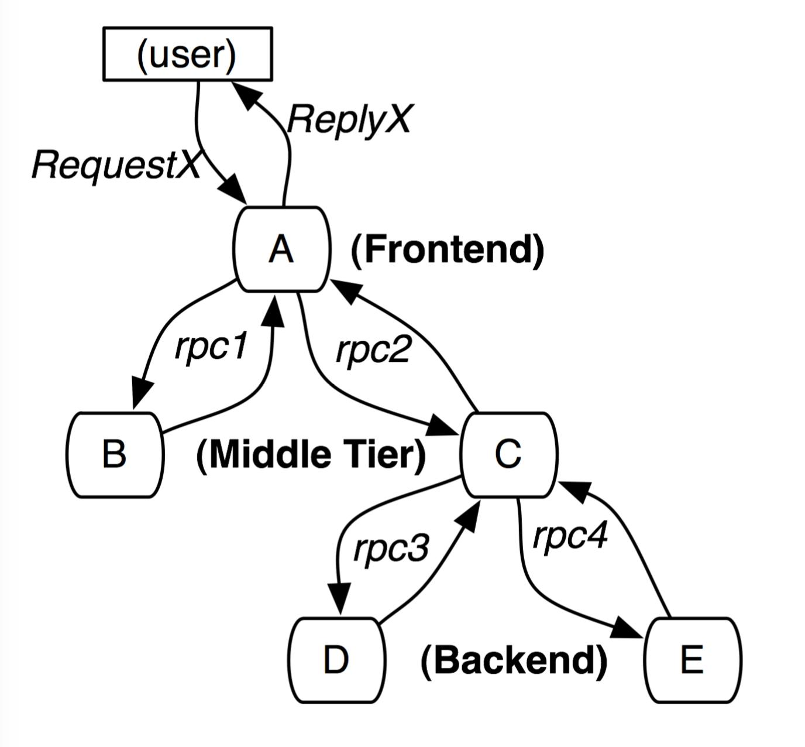
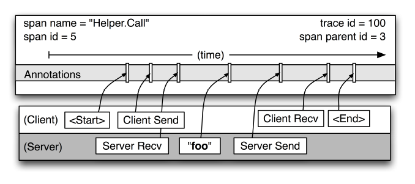
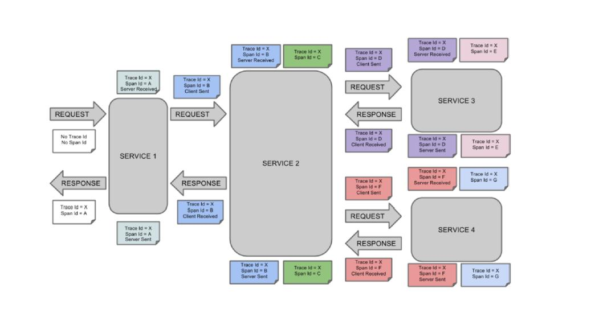
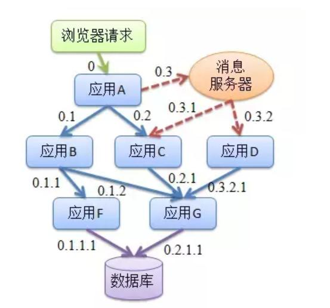

1. 一次完整的请求是一次tracer, 包括请求进入方法，执行里面的子方法（span) 到返回请求到客户端。

        trace:{
            traceId: 跟踪ID，分布式唯一，一条完整的记录根据traceId 判断是否同一个请求
            host:
            port:
            ip:
            clientIp:

        }

**注意**

> 用traceId将同一条请求下发生的记录关联起来。

2. 一条请求中每经历的一个方法都是一个span

        span{
            traceId: 跟踪id, 通过这个判断属于同一个请求
            spanId: 模块id
            spanName:模块名+类名—+方法名
            parentSpanId: 父类spanId,如果一个span 没有父Id,则为rootSpan
            clientSend: 客户端发送事件
            serverRecive: 服务器端接收时间
            serverSend: 服务端处理完成发送时间
            clientRecive: 客户端接收到时间
            serverHost:
            clientHost:
            requestIP
        }

3. Annotation: 注释（标注）

核心annotation用来定义请求的开始和结束。

a) CS（Client Sent客户端发送）：客户端发起一个请求，该 annotation描述了span的开始。

b) SR（Server Received服务器端接收）：服务器端获得请求并准备处理它。如果用SR减去CS时间戳，就能得到网络延迟。

c) SS（Server sent服务器端发送）：该 annotation表明完成请求处理（当响应发回客户端时）。如果用SS减去SR时间戳，就能得到服务器端处理请求所需的时间。

d) CR（Client Received客户端接收）： span结束的标识。客户端成功接收到服务器端的响应。如果CR减去CS时间戳，就能得到从客户端发送请求到服务器响应的所需的时间

4. 一次完整的trace 记录

一次跟踪被设计成Bigtable中的一行，每一列相当于一个span。Bigtable的支持稀疏表格布局正适合这种情况，因为每一次跟踪可以有任意多个span。跟踪数据收集（即从应用中的二进制数据传输到中央仓库所花费的时间）的延迟中位数少于15秒。第98百分位的延迟(The 98th percentile latency)往往随着时间的推移呈现双峰型;大约75%的时间，第98百分位的延迟时间小于2分钟，但是另外大约25%的时间，它可以增涨到几个小时。

5. 要记录的东西

