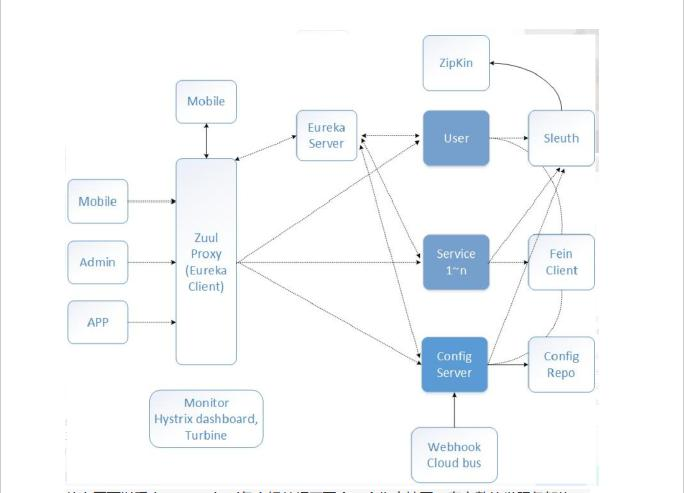

1. 为什么要做分布式链路追踪

+ 如何串联调用链，快速定位问题
+ 如何理清微服务之间的依赖关系
+ 如何进行各个服务接口的性能分折
+ 如何跟踪业务流的处理顺序

2. 架构图

+ 其中Eureka负责服务的注册与发现，很好将各服务连接起来
+ Hystrix 负责监控服务之间的调用情况，连续多次失败进行熔断保护。
+ Hystrix dashboard,Turbine 负责监控 Hystrix的熔断情况，并给予图形化的展示
+ Spring Cloud Config 提供了统一的配置中心服务
+ 当配置文件发生变化的时候，Spring Cloud Bus 负责通知各服务去获取最新的配置信息
+ 所有对外的请求和服务，我们都通过Zuul来进行转发，起到API网关的作用
+ 监控我们使用Sleuth+Zipkin+springAdmin将所有的请求数据记录下来，方便我们进行后续分析