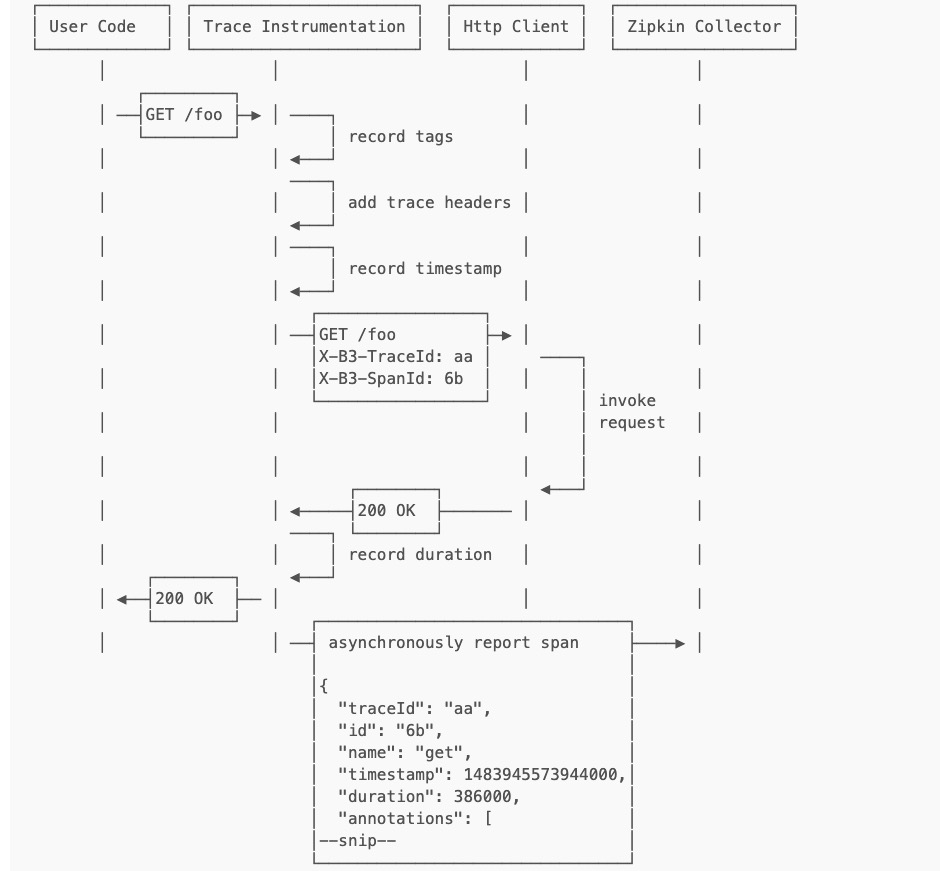

1. 大众点评

 集成方案是通过代码埋点的方式来实现监控，比如： 拦截器，注解，过滤器等。 对代码的侵入性很大，集成成本较高。风险较大

 2. zipkin 

 3. skywalking:

 步骤：

 1. 埋点与生成日志

    埋点即系统在当前节点的上下文信息，可以分为 客户端埋点、服务端埋点，以及客户端和服务端双向型埋点。埋点日志通常要包含以下内容traceId、spanId、调用的开始时间，协议类型、调用方ip和端口，请求的服务名、调用耗时，调用结果，异常信息等，同时预留可扩展字段，为下一步扩展做准备；

    不能造成性能负担：一个价值未被验证，却会影响性能的东西，是很难在公司推广的！
    因为要写log，业务QPS越高，性能影响越重。通过采样和异步log解决。

2. 手机和存储日志

    主要支持分布式日志采集的方案，同时增加MQ作为缓冲；

    每个机器上有一个 deamon 做日志收集，业务进程把自己的Trace发到daemon，daemon把收集Trace往上一级发送；
    多级的collector，类似pub/sub架构，可以负载均衡；
    对聚合的数据进行 实时分析和离线存储；
    离线分析 需要将同一条调用链的日志汇总在一起

3. 分析和统计调用链路数据，以及时效性

    调用链跟踪分析：把同一TraceID的Span收集起来，按时间排序就是timeline。把ParentID串起来就是调用栈。
    抛异常或者超时，在日志里打印TraceID。利用TraceID查询调用链情况，定位问题。
    依赖度量：

    强依赖：调用失败会直接中断主流程
    高度依赖：一次链路中调用某个依赖的几率高
    频繁依赖：一次链路调用同一个依赖的次数多

    离线分析：按TraceID汇总，通过Span的ID和ParentID还原调用关系，分析链路形态。
    实时分析：对单条日志直接分析，不做汇总，重组。得到当前QPS，延迟。

4. 实现

5. 传输：

    测库发送的跨度必须从要跟踪的服务传输到Zipkin收集器。有三种主要的传输方式：HTTP，Kafka和Scribe。

6. 模型

        [
            {
            "traceId": "5982fe77008310cc80f1da5e10147517",
            "name": "get",
            "id": "bd7a977555f6b982",
            "timestamp": 1458702548467000,
            "duration": 386000,
            "localEndpoint": {
                "serviceName": "zipkin-query",
                "ipv4": "192.168.1.2",
                "port": 9411
            },
            "annotations": [
                {
                "timestamp": 1458702548467000,
                "value": "sr"
                },
                {
                "timestamp": 1458702548853000,
                "value": "ss"
                }
            ]
            },
            {
            "traceId": "5982fe77008310cc80f1da5e10147517",
            "name": "get-traces",
            "id": "ebf33e1a81dc6f71",
            "parentId": "bd7a977555f6b982",
            "timestamp": 1458702548478000,
            "duration": 354374,
            "localEndpoint": {
                "serviceName": "zipkin-query",
                "ipv4": "192.168.1.2",
                "port": 9411
            },
            "tags": {
                "lc": "JDBCSpanStore",
                "request": "QueryRequest{serviceName=zipkin-query, spanName=null, annotations=[], binaryAnnotations={}, minDuration=null, maxDuration=null, endTs=1458702548478, lookback=86400000, limit=1}"
            }
            },
            {
            "traceId": "5982fe77008310cc80f1da5e10147517",
            "name": "query",
            "id": "be2d01e33cc78d97",
            "parentId": "ebf33e1a81dc6f71",
            "timestamp": 1458702548786000,
            "duration": 13000,
            "localEndpoint": {
                "serviceName": "zipkin-query",
                "ipv4": "192.168.1.2",
                "port": 9411
            },
            "remoteEndpoint": {
                "serviceName": "spanstore-jdbc",
                "ipv4": "127.0.0.1",
                "port": 3306
            },
            "annotations": [
                {
                "timestamp": 1458702548786000,
                "value": "cs"
                },
                {
                "timestamp": 1458702548799000,
                "value": "cr"
                }
            ],
            "tags": {
                "jdbc.query": "select distinct `zipkin_spans`.`trace_id` from `zipkin_spans` join `zipkin_annotations` on (`zipkin_spans`.`trace_id` = `zipkin_annotations`.`trace_id` and `zipkin_spans`.`id` = `zipkin_annotations`.`span_id`) where (`zipkin_annotations`.`endpoint_service_name` = ? and `zipkin_spans`.`start_ts` between ? and ?) order by `zipkin_spans`.`start_ts` desc limit ?",
                "sa": "true"
            }
            },
            {
            "traceId": "5982fe77008310cc80f1da5e10147517",
            "name": "query",
            "id": "13038c5fee5a2f2e",
            "parentId": "ebf33e1a81dc6f71",
            "timestamp": 1458702548817000,
            "duration": 1000,
            "localEndpoint": {
                "serviceName": "zipkin-query",
                "ipv4": "192.168.1.2",
                "port": 9411
            },
            "remoteEndpoint": {
                "serviceName": "spanstore-jdbc",
                "ipv4": "127.0.0.1",
                "port": 3306
            },
            "annotations": [
                {
                "timestamp": 1458702548817000,
                "value": "cs"
                },
                {
                "timestamp": 1458702548818000,
                "value": "cr"
                }
            ],
            "tags": {
                "jdbc.query": "select `zipkin_spans`.`trace_id`, `zipkin_spans`.`id`, `zipkin_spans`.`name`, `zipkin_spans`.`parent_id`, `zipkin_spans`.`debug`, `zipkin_spans`.`start_ts`, `zipkin_spans`.`duration` from `zipkin_spans` where `zipkin_spans`.`trace_id` in (?)",
                "sa": "true"
            }
            },
            {
            "traceId": "5982fe77008310cc80f1da5e10147517",
            "name": "query",
            "id": "37ee55f3d3a94336",
            "parentId": "ebf33e1a81dc6f71",
            "timestamp": 1458702548827000,
            "duration": 2000,
            "localEndpoint": {
                "serviceName": "zipkin-query",
                "ipv4": "192.168.1.2",
                "port": 9411
            },
            "remoteEndpoint": {
                "serviceName": "spanstore-jdbc",
                "ipv4": "127.0.0.1",
                "port": 3306
            },
            "annotations": [
                {
                "timestamp": 1458702548827000,
                "value": "cs"
                },
                {
                "timestamp": 1458702548829000,
                "value": "cr"
                }
            ],
            "tags": {
                "jdbc.query": "select `zipkin_annotations`.`trace_id`, `zipkin_annotations`.`span_id`, `zipkin_annotations`.`a_key`, `zipkin_annotations`.`a_value`, `zipkin_annotations`.`a_type`, `zipkin_annotations`.`a_timestamp`, `zipkin_annotations`.`endpoint_ipv4`, `zipkin_annotations`.`endpoint_port`, `zipkin_annotations`.`endpoint_service_name` from `zipkin_annotations` where `zipkin_annotations`.`trace_id` in (?) order by `zipkin_annotations`.`a_timestamp` asc, `zipkin_annotations`.`a_key` asc",
                "sa": "true"
            }
            }
        ]  