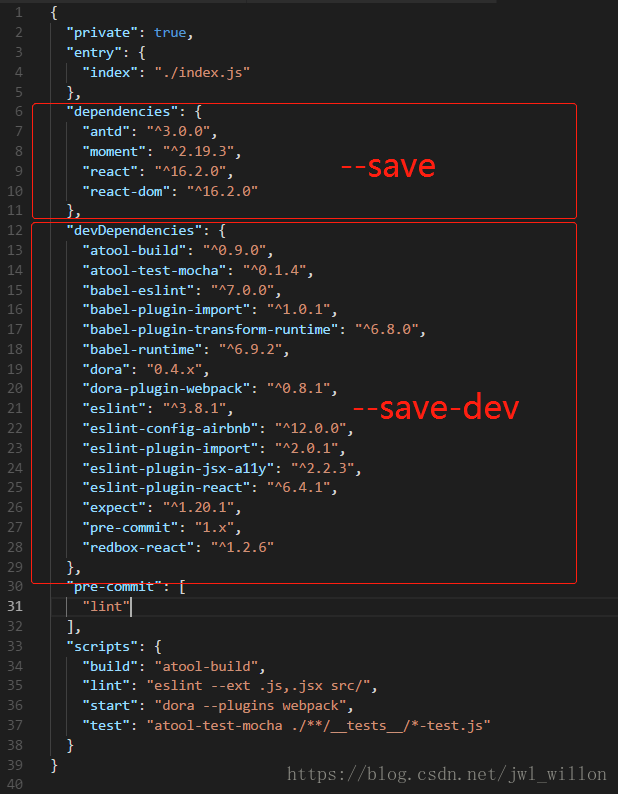

1. npm 是用来安装第三方包的命令，node.js 安装完成以后会自带的。

        npm -v   ---->6.14.6

2. 初始化package.json 文件

        npm init : 会根据提示一步一步操作创建package.json 文件

        npm init -y : 全部使用默认值创建package.json 
        

3. 安装依赖

+ devDependencies  本地开发依赖

+ dependencies  正式线上开发依赖

        npm install   ：  安装全部依赖

        npm install --prod : 仅会拉取dependencies中的依赖

        npm install <packageName>  : 本地安装名称为packageName 的模块

        比如： npm install express

        全局安装

            npm install express -g
        
        开发环境依赖

            npm install express --save-dev
            npm install express -D
        
        线上使用的依赖

            npm install express --save

            npm install express -S

3. 查看安装模块的版本号

        npm view koa version  查看当前koa的版本号

        npm view koa versions 查看koa 的所有版本号 