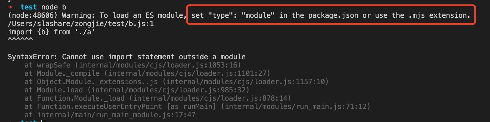
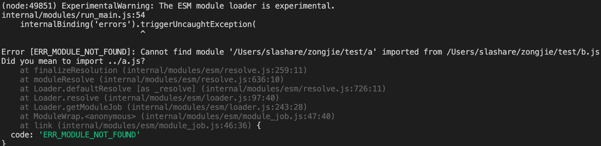

1. node.js 已经支持es6 的import

默认情况下node.js 是不支持import 导入,不然会报错

2. 在package.json 中顶层加入type

        {
            "main":"index.js",
            "name":"test",
            "type":"module"
        }

        但是引入的时候要加上后缀，不然会报错
        import {b} from './a.js' 

