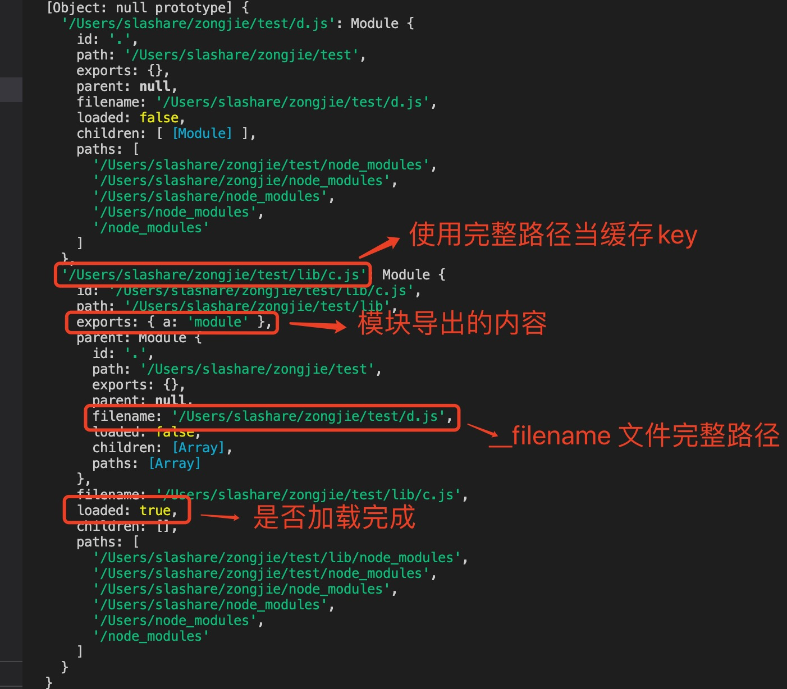

# 1.module 模块

在node.js 中一个JavaScript文件就是一个模块

> 通过import 'module' 或 require('module') 引用模块

        import {test} from './a.js'

        const {test} = require('./a')

        const test = require('./a').test;

**注意**

使用import es6 模块要在package.json 中顶级层次添加type 属性

        {
            "type":"module",// “commonjs”
        }

# 2. require

+ 用法: require(module)

    module: 可以是模块，node.js 内部模块，第三方模块，js路径模块，亦可以是json 文件。

            const obj = require('./package.json')

+ require 中可以使用变量

        const a = 'a/b.js'
        require('./'+a);

+ require 加载模块原理

  当使用node module 命令运行一个js文件时，把当前js 文件当做根入口文件，然后会根据依赖构建依赖tree, 每个模块都只加载一次，加载成功会放到缓存中，并设置loaded 为true，如果有其他文件用到时会从缓存中直接拉取，返回模块实例，不会重新加载，

  **注意**

  因为js 模块只加载一次，因此模块中不会再重新执行，从而导致模块中直接执行的永远只执行一次。

  >要让一个模块多次执行代码，导出一个函数，然后调用该函数

         在根目录下创建lib 目录

        lib/c.js

        console.log("c.__dirname:",__dirname)
        console.log("c.__filename",__filename)
        console.log("c.process.cwd",process.cwd())

        module.exports={
            a:'module'
        }

        在根目录下创建d.js

        const obj = require('./lib/c')
        console.log("d.__dirname:",__dirname)
        console.log("d.__filename",__filename)
        console.log("d.process.cwd",process.cwd())
        console.log(obj)

        在根目录下创建e.js

        require('./d')
        require('./lib/c')

        执行node e

        c.__dirname: /Users/slashare/zongjie/test/lib
        c.__filename /Users/slashare/zongjie/test/lib/c.js
        c.process.cwd /Users/slashare/zongjie/test
        d.__dirname: /Users/slashare/zongjie/test
        d.__filename /Users/slashare/zongjie/test/d.js
        d.process.cwd /Users/slashare/zongjie/test

        *** c 里面的console.log 这种直接运行的只执行了一次 ***

+ require.cache

如果require.cache未修改，则多次调用require('foo') 不会导致模块代码被多次执行

+ require.resolve(module)

返回模块的完整路径，但是不加载模块

        require.resolve('./lib/c')

        ========>

        /Users/slashare/zongjie/test/lib/c.js

+ require.main

直接从Node.js运行文件时，require.main将其设置为 module。这意味着可以通过测试确定文件是否已经直接运行require.main === module。

对于文件foo.js，true如果通过运行node foo.js，false则为，如果通过运行， 则为require('./foo')。