1. typescript 默认配置文件 tsconfig.json

2. 配置文件参数说明：

+ experimentalDecorators： true 开启装饰器
+ emitDecoratorMetadata： true 一起开启，元数据

+ target: 指定编译ts文件生成js脚本时遵循的js 规范，默认是es3, 其他值es5, 'ES2015', 'ES2016', 'ES2017', 'ES2018', 'ES2019', 'ES2020', or 'ESNEXT',

+ module: 生成的模块类型,none,commonjs(node),amd,umd,es2015

+ sourceMap:  是是否生成SourceMap的开关，如果设置为true，则会生成.map文件。

 "sourceMap": true,                     /* 生成 '.map' 文件. */

 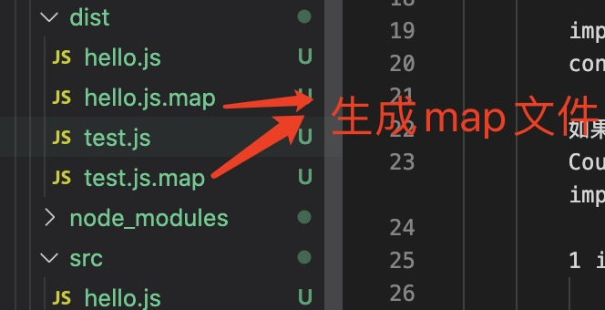

+ removeComments: 生成js 文件时，是否去除文档注释,true: 去除,默认值false: 不去除

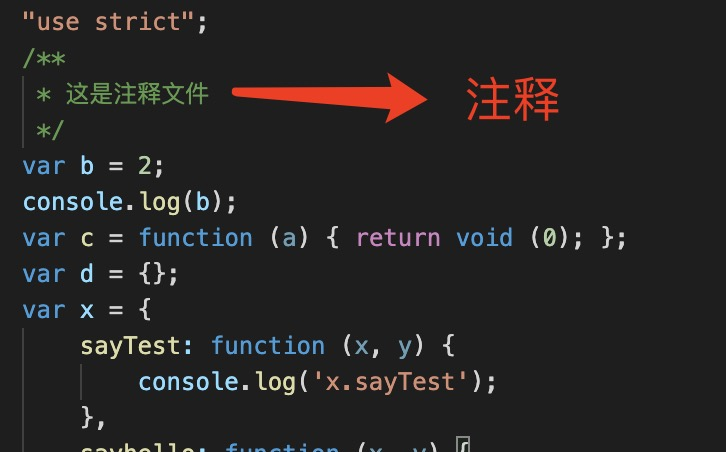
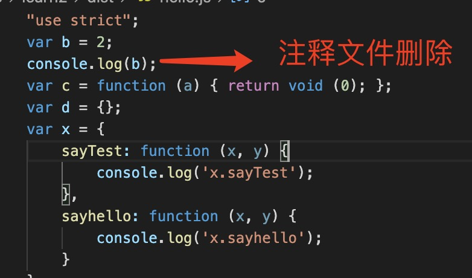

+ declaration： 是否生成.d.ts 文件

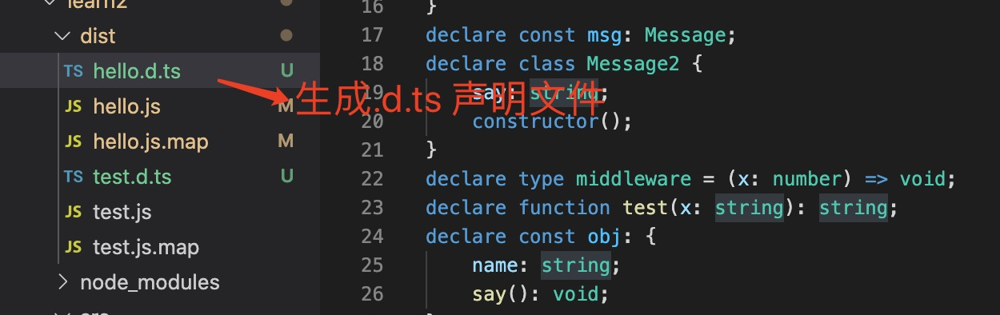

+ declarationMap : 生成.d.ts.map 文件，必须declaration：true 一起使用

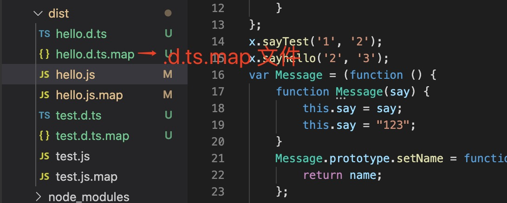

+ declarationDir: 默认ts 声明文件和声明map文件 会和生成的js 在同一目录中，declarationDir设置声明和声明map 文件的存放地址

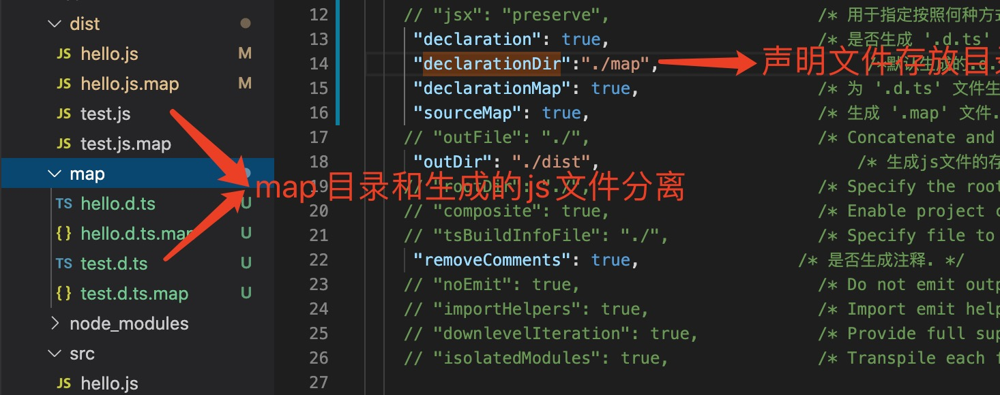

+ jsx: 用于指定按照何种方式生成jsx代码: 'preserve', 'react-native', or 'react'

+ noEmit: 当设置为true时，tsc编译ts文件时将不会输出js文件.

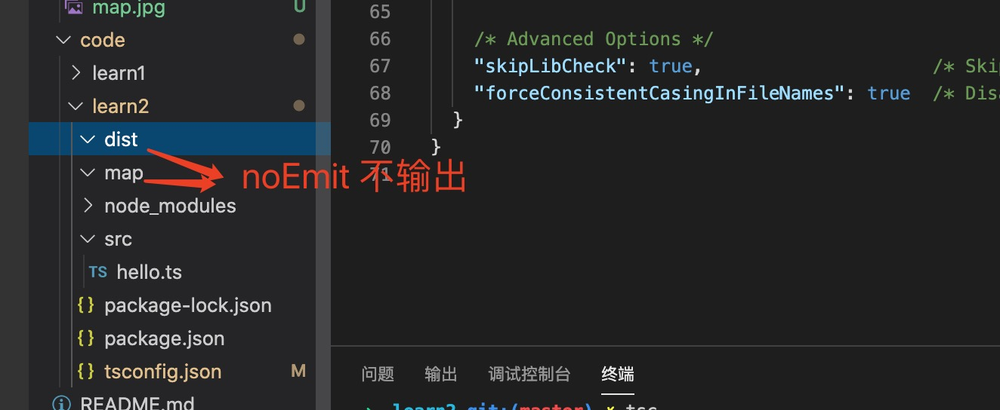
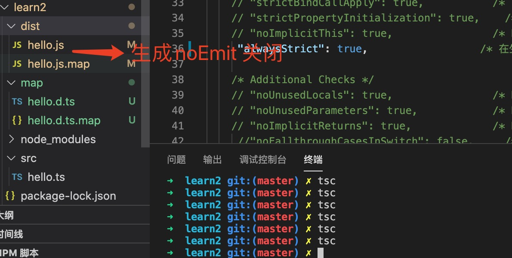

> noEmitOnError: 当typescript 文件中有错误时，不生成JavaScript文件。

不开启的话，即使typescript 文件报错也会生成js 文件

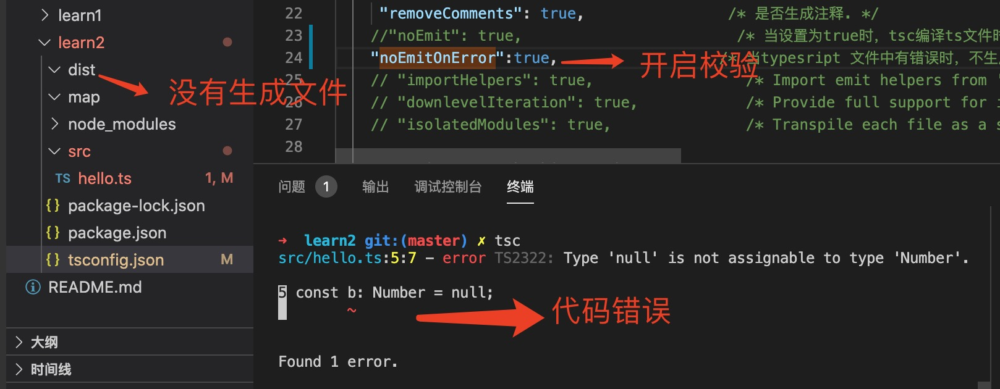
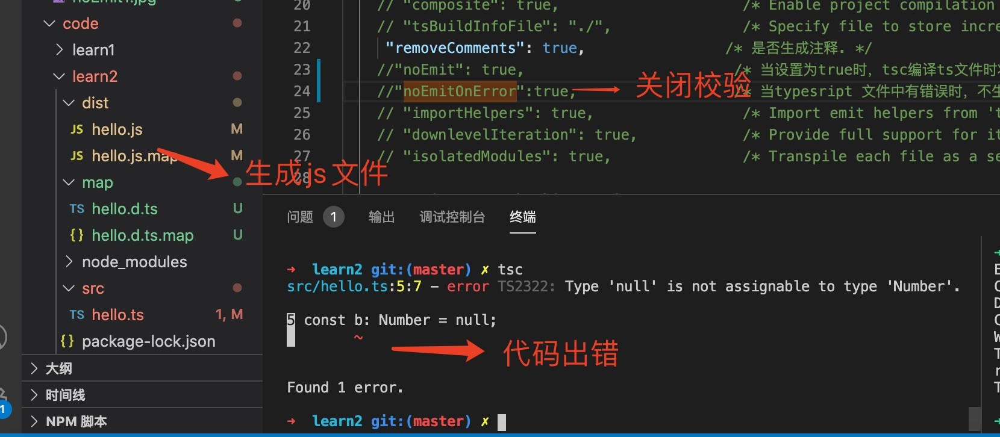
+ allowJs ： 当在typescript 中需要引入js 文件或者js 文件中的变量时，需要设置allowJs:true, 否则会报错

        test.js

        export const a=123;

        hello.ts

        import {a} from './test'
        console.log(a);

        如果allowJs 没有设置或者false,那么会报错
        Could not find a declaration file for module './test'. '/Users/slashare/zongjie/node-typescript/code/learn2/src/test.js' implicitly has an 'any' type.

        1 import {a} from './test'
                  ~~~~~~~~

        at createTSError (/usr/local/lib/node_modules/ts-node/src/index.ts:434:12)
        at reportTSError (/usr/local/lib/node_modules/ts-node/src/index.ts:438:19)
        at getOutput (/usr/local/lib/node_modules/ts-node/src/index.ts:578:36)
        at Object.compile (/usr/local/lib/node_modules/ts-node/src/index.ts:775:32)
        at Module.m._compile (/usr/local/lib/node_modules/ts-node/src/index.ts:858:43)
        at Module._extensions..js (internal/modules/cjs/loader.js:1157:10)
        at Object.require.extensions.<computed> [as .ts] (/usr/local/lib/node_modules/ts-node/src/index.ts:861:12)
        at Module.load (internal/modules/cjs/loader.js:985:32)
        at Function.Module._load (internal/modules/cjs/loader.js:878:14)
        at Function.executeUserEntryPoint [as runMain] (internal/modules/run_main.js:71:12)

        设置完allowJs:true  ，会正常打印123.

+ outDir： ts 文件编译完以后生成的路径,默认./

        tsc 编译ts 文件后生成的文件目录
+ strict： 严格模式,会自动检查其他几项

        在非严格模式下

        const a:Number=null;  // 非严格模式是正确的

        严格模式下：

        const a:Number =null; // 报错，不能将类型“null”分配给类型“Number”

+ strictNullChecks: 严格检查null 类型

         const a:Number =null; // 报错，不能将类型“null”分配给类型“Number”

+ alwaysStrict： ts 文件生成js 文件时，默认开启严格模式

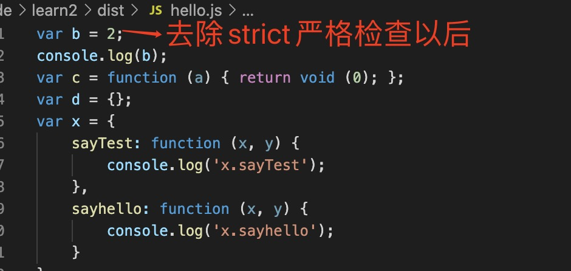
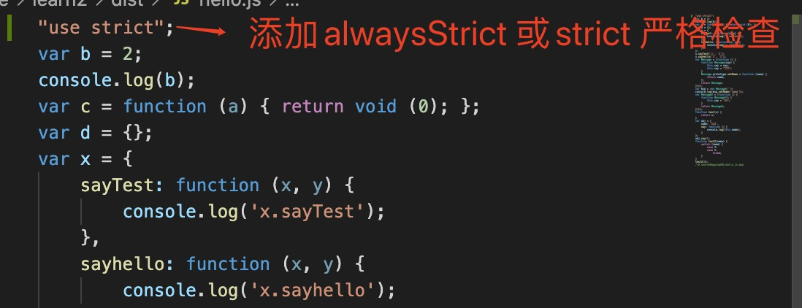