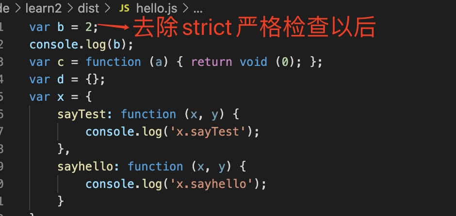

1. typescript 启用严格模式，在tsconfig.json 中配置strict：true,会校验以下几种类型：

+ noImplicitAny： 隐式any

此规则不允许变量或函数参数具有隐式any类型

        function show(list){
            list.forEach(element => {
                console.log(element)
            });
        }

        参数“list”隐式具有“any”类型

可以使用any 显示定义类型

        const d:any ={}

+ strictNullChecks: 强制检查null 和 undefined 类型。

此规则不允许出现null或undefined的可能性

        在非严格模式下： 
             const a:Number = null;// 正确

        在严格模式下：

             const a:Number = null; // 报错，

+ noImplicitThis: 此规则不允许this上下文隐式定义

+ strictPropertyInitialization
此规则将验证构造函数内部初始化前后已定义的属性。

必须要确保每个实例的属性都有初始值，可以在构造函数里或者属性定义时赋值。

（strictPropertyInitialization，这臭长的命名像极了React源码里的众多任性属性）

请看以下示例：

// Typescript非严格模式
class User {
  username: string;
}

const user = new User();

const username = user.username.toLowerCase();
如果启用严格模式，类型检查器将进一步报错：

class User {
  username: string;
  //    ❌  ^^^^^^
  //     Property 'username' has no initializer
  //     and is not definitely assigned in the constructor
}

const user = new User();
/
const username = user.username.toLowerCase();
 //                 ❌         ^^^^^^^^^^^^
//          TypeError: Cannot read property 'toLowerCase' of undefined
解决方案有四种。

方案＃1：允许undefined
为username属性定义提供一个undefined类型：

class User {
  username: string | undefined;
}

const user = new User();
username属性可以为string | undefined类型，但这样写，需要在使用时确保值为string类型：

const username = typeof user.username === "string"
  ? user.username.toLowerCase()
  : "n/a";
这也太不Typescript了。

方案＃2：属性值显式初始化
这个方法有点笨，却挺有效：

class User {
  username = "n/a";
}

const user = new User();

// OK
const username = user.username.toLowerCase();
方案＃3：在构造函数中赋值
最有用的解决方案是向username构造函数添加参数，然后将其分配给username属性。

这样，无论何时new User()，都必须提供默认值作为参数：

class User {
  username: string;

  constructor(username: string) {
    this.username = username;
  }
}

const user = new User("mariusschulz");

// OK
const username = user.username.toLowerCase();
还可以通过public修饰符进一步简化：

class User {
  constructor(public username: string) {}
}

const user = new User("mariusschulz");

// OK
const username = user.username.toLowerCase();
方案＃4：显式赋值断言
在某些场景下，属性会被间接地初始化（使用辅助方法或依赖注入库）。

这种情况下，你可以在属性上使用显式赋值断言来帮助类型系统识别类型。

class User {
  username!: string;

  constructor(username: string) {
    this.initialize(username);
  }

  private initialize(username: string) {
    this.username = username;
  }
}

const user = new User("mariusschulz");

// OK
const username = user.username.toLowerCase();
通过向该username属性添加一个明确的赋值断言，我们告诉类型检查器：
username，即使它自己无法检测到该属性，也可以期望该属性被初始化。

+ alwaysStrict: ts 文件生成js 文件时，默认开启严格模式

