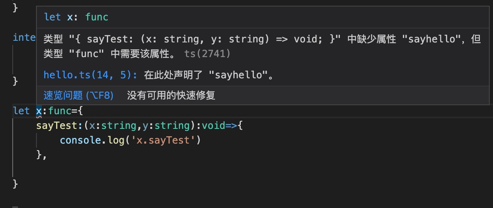
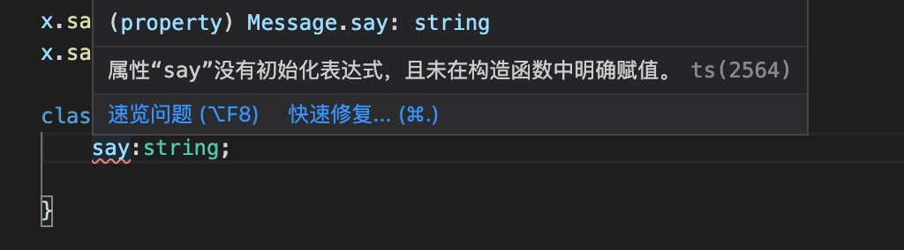

1. 基础类型

+ number: 和JavaScript一样，TypeScript里的所有数字都是浮点数。 这些浮点数的类型是 number

+ string: 字符串类型

+ boolean: 布尔类型，true/false

+ null : 如果开启了strictNullChecks,

+ undefined: 

**注意**

默认情况下null和undefined是所有类型的子类型。 就是说你可以把 null和undefined赋值给number类型的变量。

        let a:number = null;
        let c:string = undefined;

然而，当你指定了--strictNullChecks标记，null和undefined只能赋值给void和它们各自。 这能避免 很多常见的问题。 也许在某处你想传入一个 string或null或undefined，你可以使用联合类型string | null | undefined。 

        type string1 = string | null | undefined;

        let a:string1 = '123';

        let a:string1 = null;

        let a:string2 = undefined;

+ void: 没有任何类型,用于函数

2. 引用类型

+ any: 任意类型

+ 数组： 

   + Type[]:

            let a:number[] = [] ;// 整形的数组，这个数组只能存储数字类型的元素
   
   + Array< Type > :

            let a:Array<number> = [1,2,3]

+ 枚举

        enum Color {Red, Green, Blue}

        let c: Color = Color.Green;

默认情况下，从0开始为元素编号。 你也可以手动的指定成员的数值。 例如，我们将上面的例子改成从 1开始编号：

        enum Color {Red = 1, Green, Blue}
        let c: Color = Color.Green;

或者，全部都采用手动赋值

        enum Color {Red = 1, Green = 2, Blue = 4}
        let c: Color = Color.Green;

+ any : 任意类型

3. 接口类型

接口只有类型定义，没有实现

        interface message{
            name:string;
        }

> 默认情况下,定义的属性为必填属性

> 可选属性使用?

        interface message{
            name?:string;
        }

> 可读属性

        interface message{
            readonly name:string;
        }

> 带有任意数量的其它属性，那么我们可以这样定义它：

        interface SquareConfig {
            color?: string;
            width?: number;
            [propName: string]: any;
        }
> 可索引

            interface StringArray {
                [index: number]: string;
            }

            let myArray: StringArray;
            myArray = ["Bob", "Fred"];

            let myStr: string = myArray[0];

> 函数类型

            interface func{
                sayhello:(x:string,y:string)=>void,
                sayTest(x:string,y:string):void
            }
            两种方式，箭头函数和方法简写

> 单独表示一个函数

            interface SearchFunc {
              (source: string, subString: string): boolean;
            }
> 实现接口

    实现接口的对象要实现接口中所有必要属性，不然会报错

4. class 类

+ 类型定义

        class Learn{

        }

+ 构造函数

        class Learn {
            constructor(){

            }
        }

+ 实例化: 实例化调用的类的构造函数，构造函数是否有参数，决定实例化时是否传入参数

        const learn = new Learn();

+ 继承: 会自动拥有父类的一切可继承的成员(属性和方法)

        class Parent{
            constructor(){
                this.name='123'
            }
        }

        class child extends Parent{
            constructor(name: string) { super(); }
        }
> super 当作为函数时，代表父类的构造函数，ES6 要求，子类的构造函数必须执行一次super函数。

**注意** 

必须在this 使用前调用一次super()

> super 作为对象时，在普通方法中，指向父类的原型对象；在静态方法中，指向父类

+ 实例成员

> 在实例类中构造函数之前定义

        class Message{
            say:string="33";
        }

        const msg = new Message();
        msg.say ====>33

> strictPropertyInitialization 或者strict 严格检查 要求属性在定义或者构造函数中初始化.

        class Message2{
            say: string;
            constructor(){
                this.say="44";
            }
        }

> 在构造函数参数中添加修饰符，会自动创建成员变量

        class Message{
            // 构造函数添加修饰符自动创建成员变量
            constructor(public say:string){
                this.say="123"
            }
        }

+ 属性修饰符

> 默认为public : 在TypeScript里，成员都默认为 public。

   你也可以明确的将一个成员标记成 public

        class Message{
            public name:string="";
            public setName(name:string):void{

            }
        }

> private : 私有变量，只能在类的内部访问

> protected: 受保护的，类的内部和自类中访问

> readonly: 只读修饰符

+ getter/setter

            class Employee {
                private _fullName: string;

                get fullName(): string {
                    return this._fullName;
                }

                set fullName(newName: string) {
                    if (passcode && passcode == "secret passcode") {
                        this._fullName = newName;
                    }
                    else {
                        console.log("Error: Unauthorized update of employee!");
                    }
                }
            }

            let employee = new Employee();
            employee.fullName = "Bob Smith";
            if (employee.fullName) {
                alert(employee.fullName);
            }
> 只读  ： 只有getter

> 只写：  只有setter

+ static 静态属性
